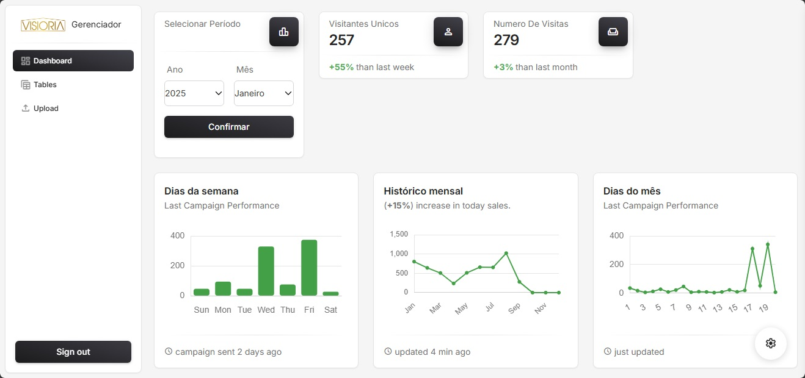
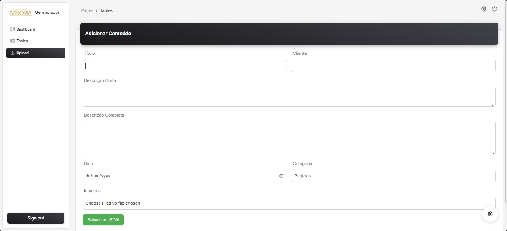
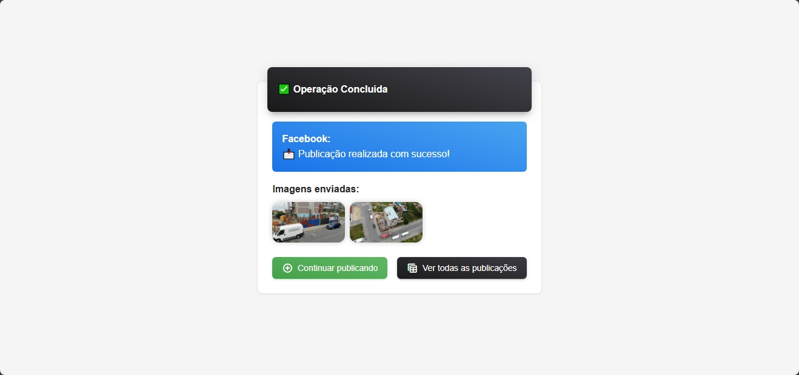
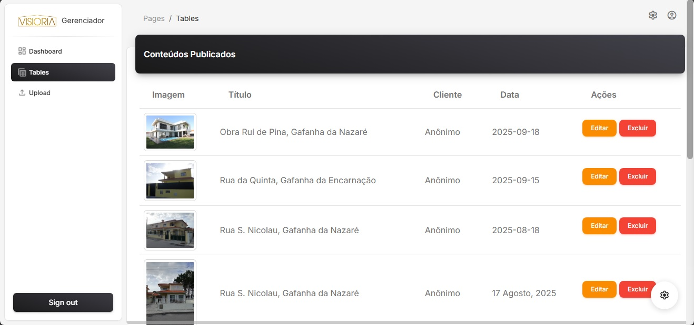

# 📊 Dashboard PHP – Visioria

## 📌 Descrição
Este projeto é um **dashboard administrativo em PHP**, com recursos de **upload de imagens**, **compartilhamento no Facebook** e **analytics**.  
Ele inclui autenticação de usuários, organização de imagens por ID e relatórios em tempo real.  

Ideal para **gerenciar mídia integrada com redes sociais**.  

---

## 🛠️ Funcionalidades
- [x] Upload, importação e exclusão de **fotos individuais**
- [x] Organização e ordenação de imagens por **ID**
- [x] Compartilhamento direto no **Facebook**
- [x] Dashboard com estatísticas e Analytics
- [x] Autenticação (login, logout, cadastro)
- [x] Relatórios em tabelas

---

## ⚙️ Instalação

1. Clone este repositório:
   ```bash
   git clone https://github.com/SEU_USUARIO/visioria-dashboard.git
2. Configure o projeto em um servidor PHP (Apache, Nginx ou XAMPP).

3. Ajuste as permissões da pasta uploads/:

chmod 775 pages/uploads


4. Configure a API do Facebook em facebook.php e facebook_token.json.

5. Acesse no navegador:

http://localhost/project/pages/index.php

---

## 🚀 Uso

- **Página inicial** → `index.php`  
- **Login / Cadastro** → `sign-in.php` / `sign-up.html`  
- **Dashboard** → estatísticas e relatórios  
- **Upload de fotos** → adicionar e organizar imagens  
- **Tabelas** → visualização de dados e relatórios  
- **Compartilhar** → enviar fotos para o Facebook  

---

## 📸 Prints de Tela

### 🔹 Página Inicial (Index)  
  

### 🔹 Dashboard  
  

### 🔹 Upload  
  

### 🔹 Upload  
  

### 🔹 Tabelas  
  


---

## 🧰 Tecnologias Utilizadas

- **PHP** (backend)  
- **HTML5, CSS3, SCSS, JavaScript** (frontend)  
- **Facebook Graph API**  
- **JSON** (armazenamento auxiliar de dados)  

---

## 📜 Licença

Este projeto está sob a licença **MIT** – fique à vontade para usar e modificar.  

---
